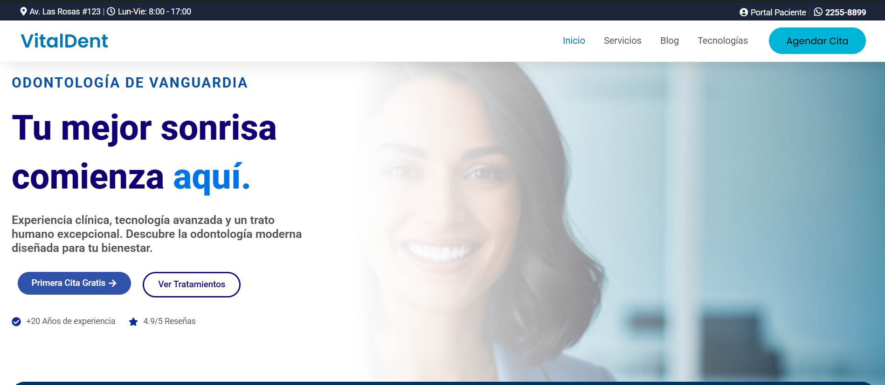
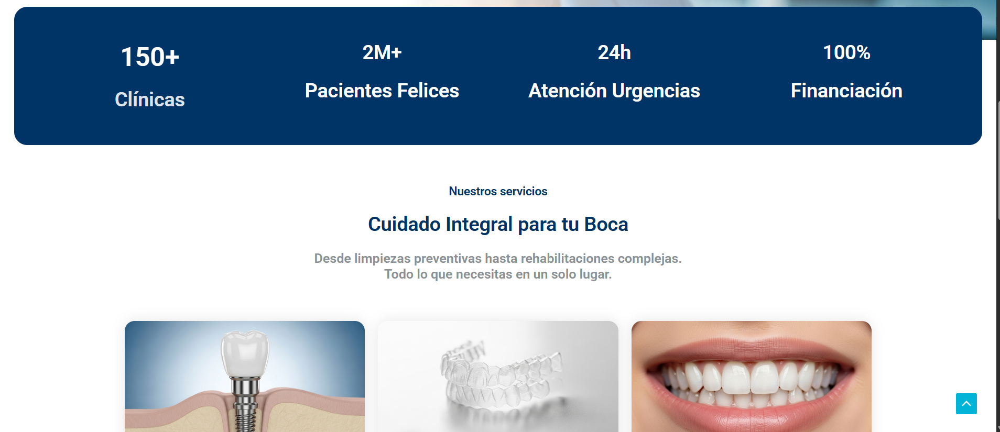

# Proyecto Clínica Dental VitalDent 🦷

Sitio web profesional desarrollado con WordPress, Elementor y CSS personalizado.

## Tecnologías usadas
* WordPress & Astra Theme
* Elementor (Diseño Responsive)
* CSS3 (Efectos de vidrio, tarjetas flotantes, animaciones)
* PHP (Snippets personalizados)

## Capturas del Proyecto

### Portada y Menú Flotante

### Seccion de Cuadro de datos

### Sección de Servicios
.png)

## 🚧 Estado del proyecto
En desarrollo - Trabajando actualmente en la sección de testimonios.
